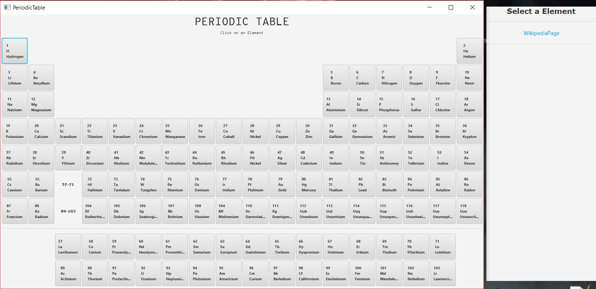

# PeriodicTable
This is a JavaFX Application showing a interactive periodic table which links you to the element's wikipedia-page for now. This will change because this is still a WIP-project.

# Future features
- further information of the element in the information-window on the right (image, ...)
- colored tiles for metals and nonmetals
