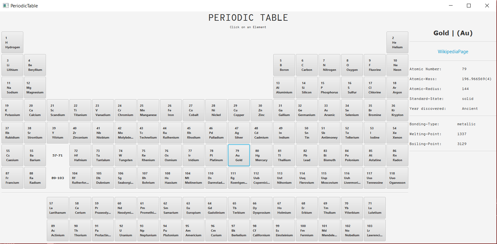

# PeriodicTable
This is a JavaFX Application showing a interactive periodic table which links you to the element's wikipedia-page for now.

# Future features
- further information of the element in the information-window on the right (image, ...)
- colored tiles for metals, ...
- the element information is saved locally -> download updated lists with launch
- better Visuals (CSS-Style-improvements)

# Usage
Downloading, launching and using the PerdiodicTable.jar-file doesn't require any other downloads, code or software. It can be launched just like any other .exe/.bat
When using the code/project the simplejson.jar/library is necessary.

# Known Issues
- when launching the applet on the desktop with scaled desktop, the aspect-ratio and layout may look weird and do not represent the applet, I want it to be. (WIP)
- saving the information in a string is horrible to store data, which should be easy to view and edit.
